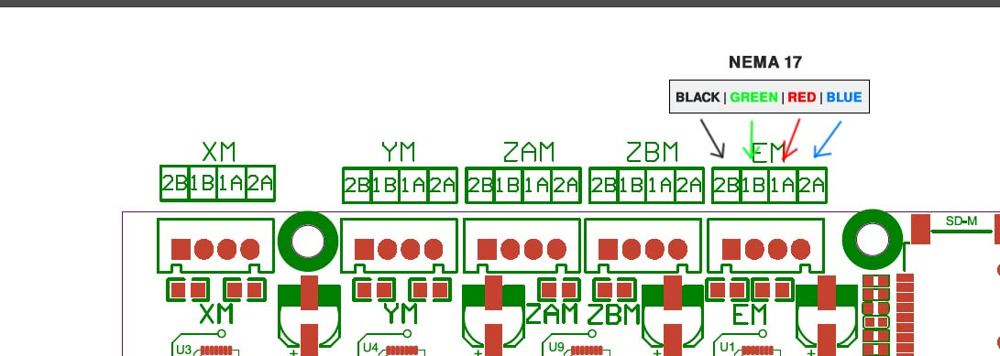

# Marlin configurations

Конфигурация для 3D принтера **Ender 3 Pro** с апгрейдами:

* Плата **BigTreeTech SKR Mini E3 2.0**
* Экструдер **BMG clone**
* Хотенд **E3DV6**
* Датчик уровня стола **Trianglelab 2021 v3 3D Touch**
* Собственное спроектированное крепление **E3BMGS - Крепление директ BMG(clone) + E3DV6 экструдера**

Подключение мотора от BMG:

